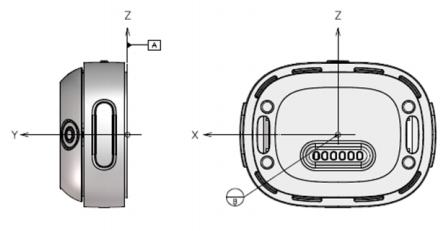
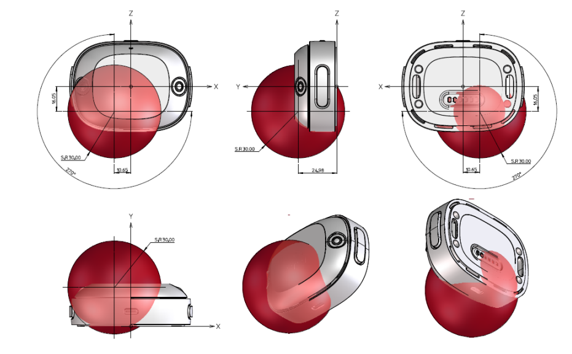
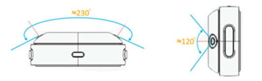

# VIVE 自定位追踪器数据传输与可视化

本项目旨在将 VIVE Tracker 的位姿数据从连接 VR 设备的 Windows 电脑实时传输到 Linux (Ubuntu) 电脑，并提供实时可视化和轨迹分析工具。

## 架构说明

*   **发送端 (Windows)**: 通过 SteamVR 获取追踪器数据，并使用 UDP 协议发送。
*   **接收端 (Linux)**: 接收 UDP 数据包，进行 3D 可视化展示或直线轨迹误差分析。

## 环境准备

### 发送端 (Windows 电脑)

1.  **前置条件**:
    *   已安装 SteamVR 和 VIVE Hub。
    *   在 VIVE Hub 中完成 VIVE Tracker 的配对、建图和追踪设置。详细操作参考 [VIVE 自定位追踪器 官方支持手册](https://www.vive.com/cn/support/ultimate-tracker/category_howto/setting-up-for-steamvr-compatible-headsetes.html)。

2.  **安装 Python 依赖**:
    ```bash
    pip install openvr transforms3d
    ```

### 接收端 (Linux 电脑)

1.  **安装 Python 依赖**:
    ```bash
    pip install pyvista matplotlib
    ```
    *   `pyvista`: 用于实时 3D 可视化。
    *   `matplotlib`: 用于轨迹分析图表绘制。

## 配置与运行

### 1. 发送端配置 (Windows)

1.  **修改 `data_sender.py`**:
    打开文件，找到配置部分，修改 `UBUNTU_IP` 为接收端电脑的 IP 地址：
    ```python
    # --- 配置 ---
    UBUNTU_IP = "192.168.20.152"  # 接收端的IP地址，请务必修改
    PORT = 9999                 # 端口号，必须与接收端一致
    ```

2.  **修改 `triad_openvr/config.json`**:
    根据实际连接的追踪器修改配置：
    ```json
    {
        "devices":[
            {
                "name": "tracker_right",
                "type": "Tracker",
                "serial":"3A-A33H04688"
            }
        ]
    }
    ```
    *   **名称一致性**: `name` 字段（如示例中的 `"tracker_right"`）必须与 `data_sender.py` 代码中调用的设备名称严格一致。例如，如果代码中写的是 `v.devices["tracker_right"].get_pose_matrix()`，那么配置文件中的 `name` 也必须是 `"tracker_right"`。
    *   **获取序列号**: 可以通过运行修改后的 `data_sender.py` (将初始化改为 `v = triad_openvr.triad_openvr()`) 来自动发现并打印所有已连接设备的序列号。

3.  **运行发送程序**:
    ```bash
    python data_sender.py
    ```

### 2. 接收端运行 (Linux)

提供两个接收端程序，分别用于不同的用途。

#### 功能 A: 实时 6D 姿态可视化 (`visualize_receiver.py`)
用于实时显示追踪器在空间中的位置和旋转。

1.  **配置**: 检查 `visualize_receiver.py` 中的 `PORT` 是否与发送端一致。
2.  **运行**:
    ```bash
    python visualize_receiver.py
    ```

#### 功能 B: 轨迹记录与分析 (`visualize_trajectory.py`)
用于记录一段轨迹，拟合直线并分析误差

1.  **配置**: 检查 `visualize_trajectory.py` 中的 `PORT` 是否与发送端一致。
2.  **运行**:
    ```bash
    python visualize_trajectory.py
    ```
3.  **操作**:
    *   程序启动后等待数据流。
    *   按 `Enter` 开始记录数据。
    *   按 `Ctrl+C` 停止记录，程序将自动进行直线拟合分析，并弹出误差分析图。
    *   分析完成后可选择是否保存数据为 CSV 文件。

## VIVE 自定位追踪器使用注意事项

- VIVE 自定位追踪器局部坐标定义：


- 为保持无线连接稳定（性能不低于 3 dB），请确保追踪器天线馈电点周围 **30mm 半径范围**内（如下图红色球体区域）无金属部件。金属会严重干扰射频信号。



- 追踪器的水平视场角约为 **230°**，垂直视场角约为 **120°**。在安装或固定追踪器时，避开摄像头的视场范围，确保无遮挡，否则会阻挡视觉定位，导致追踪丢失。



- 如果遇到追踪不稳或漂移，请检查以下因素：
    *   **光照**: 环境亮度应适中（能舒适阅读书籍的标准），避免过暗、强光或眩光。
    *   **纹理**: 避免环境中有大面积纯色/空白的墙壁、地板或天花板。建议铺设图案地毯或悬挂海报以增加视觉特征点。
    *   **反光**: 移除环境中的镜子或高反光物体。
    *   **清洁**: 定期使用干燥的超细纤维布清洁摄像头镜头。
    *   **距离**: 保持追踪器与障碍物至少 1.5 米的距离。

**更多信息参看[官方手册](asset/HTC_VIVE_Ultimate_Tracker_Developer_Guidelines_v3.0_(20250121).pdf)**
